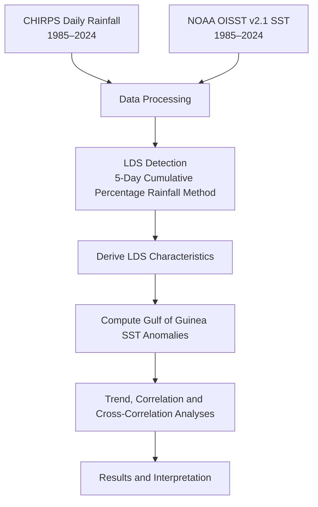
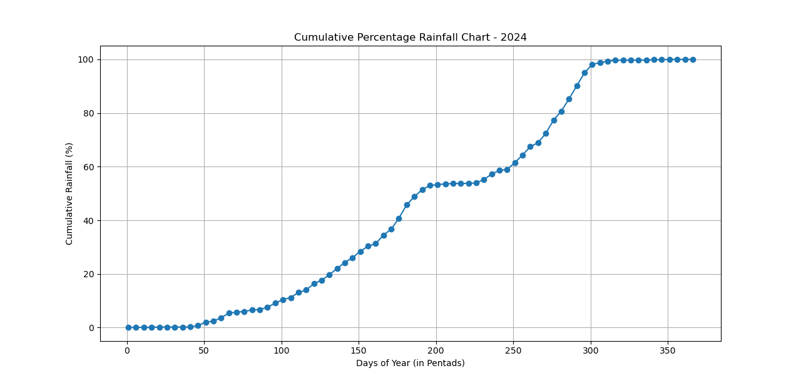

**Contents**
Abstract
Results & Discussion (Splitted into Logical Sections)
Key Findings & Conclusion
Implication & Recommendation
Limitations & Future Work
Repository information
References
How to Reproduce. 

# Assessment of the Changing Characteristics of the Little Dry Season across Southwestern Nigeria in Relation to Gulf of Guinea Sea Surface Temperature

## Background
The **Little Dry Season (LDS)** is a short-lived reduction in rainfall that occurs during the peak of the rainy season across southwestern Nigeria, typically between **mid-July and mid-August**. Despite its brief duration, it plays an important role in agriculture, water resource management, and ecosystem functioning. Farmers have traditionally relied on this seasonal break for activities such as weeding, fertilizer application, and harvesting, while the characteristics of the LDS have also been linked to the yield of important crops such as yam.

Over recent decades, however, the timing and behaviour of the LDS have become increasingly variable. Reports of delayed onset, prolonged duration, false seasonal breaks, and changing rainfall characteristics suggest that the phenomenon is responding to broader climatic changes. Such changes increase uncertainty for rain-fed agriculture, threaten food security, and complicate climate adaptation planning across the region.

The development of the LDS is influenced by a combination of atmospheric and oceanic processes, with **Sea Surface Temperature (SST)** variability over the **Gulf of Guinea** recognized as one of the dominant regional drivers. Changes in SST alter evaporation, atmospheric moisture availability, and convective activity, thereby influencing the distribution and intensity of rainfall across southwestern Nigeria.

Although previous studies have provided valuable insights into the variability of the LDS, many have relied on station observations or relatively short temporal records, limiting their ability to detect long-term regional changes. Furthermore, comparatively few studies have comprehensively examined how changes in Gulf of Guinea SST influence the evolving characteristics of the LDS over multiple decades. This project addresses these gaps by integrating **40 years (1985–2024)** of high-resolution CHIRPS rainfall observations with **NOAA Optimum Interpolation Sea Surface Temperature (OISST v2.1)** data to investigate how the characteristics of the Little Dry Season have evolved under a warming climate and to assess the role of Gulf of Guinea SST variability in shaping these changes.

**Figure 1.** Sample of rainfall cumululative chart (year 2024) showing the sharp decline in rainfall during the Little Dry Season across southwestern Nigeria.

## Objectives
The project aims to evaluate recent changes in the characteristics of the Little Dry Season (LDS) across southwestern Nigeria and investigate the influence of Gulf of Guinea sea surface temperatures.

Specifically, the study seeks to:

- Detect the annual onset and cessation dates of the Little Dry Season using a cumulative percentage rainfall approach.
- Quantify key LDS characteristics, including duration, total rainfall, number of rain days, mean daily rainfall, rainfall per rain day, and rainfall intensity index.
- Examine long-term trends in these characteristics between 1985 and 2024.
- Analyse temporal variability in Gulf of Guinea Sea Surface Temperature (SST) and SST anomalies.
- Evaluate statistical relationships between LDS characteristics and SST anomalies using correlation and cross-correlation analyses.
- Provide insights into how regional ocean warming may influence sub-seasonal rainfall behaviour and climate adaptation in southwestern Nigeria.

## Study Area
The study covers mostly the **Southwestern Nigeria**, extending approximately between **4°–9°N** and **3°–7°E**, where the Little Dry Season is most pronounced. This specifically includes Lagos, Ogun, Oyo, Osun, Ondo, Ekiti, and adjoining areas of Edo which fall within the LDS climatic zone.
The region experiences a humid tropical climate characterized by a **bimodal rainfall regime**, with rainfall peaks occurring around **July** and **September**, separated by the Little Dry Season during July–August.
Rainfall in the region is strongly influenced by the West African Monsoon, the migration of the Intertropical Discontinuity (ITD), and ocean–atmosphere interactions over the Gulf of Guinea. These factors make southwestern Nigeria one of the most suitable regions for studying changes in intra-seasonal rainfall variability.

**Figure 2.** Study area showing southwestern Nigeria and average rainfall distribution during July - August Period

## Data & Methodology

### Datasets

| Dataset | Source | Resolution | Period | Purpose |
|----------|--------|------------|--------|---------|
| CHIRPS Daily Precipitation | Climate Hazards Center | 0.05° | 1985–2024 | Derivation of LDS characteristics |
| NOAA OISST v2.1 Monthly SST | NOAA | 0.25° | 1985–2024 | Detection of Gulf of Guinea SST Trends and Anomalies |

### Methodology
The analysis was implemented entirely in **Python** using libraries including **xarray**, **NumPy**, **Pandas**, **Matplotlib**, **Rioxarray**, **GeoPandas**, and **SciPy**.
The workflow consisted of the following steps:

1. **Rainfall preprocessing**
   - Loaded and cleaned CHIRPS daily rainfall data for analysis
   - Spatially averaged daily rainfall over southwestern Nigeria.
   - Generated cumulative rainfall percentage curves for each year.
   - Generated rainfall curves for each decade 

2. **LDS detection**
   - Applied the **5-day cumulative percentage rainfall (pentad)** method to identify annual LDS onset and cessation pentad dates and saved values in a summary table. 
   - Converted pentad dates into calendar dates and day-of-year values.
  
### 3. Derivation of LDS Characteristics / Metrics
The following annual LDS metrics were derived for each year to characterize the timing, duration, and rainfall conditions of the Little Dry Season:

- **Duration (days):** Number of days between the identified onset and cessation of the LDS, indicating its persistence.
- **Total rainfall (mm):** Total rainfall received during the LDS period, representing the overall rainfall amount.
- **Number of rain days (≥ 1 mm):** Count of days with at least 1 mm of rainfall during the LDS, indicating rainfall occurrence.
- **Rain-day frequency (%):** Percentage of LDS days that experienced rainfall (≥ 1 mm), indicating how often rainfall occurred during the season.
- **LDS Rainfall per rain day (mm rain day⁻¹):** Average rainfall on rainy days only (≥ 1 mm), excluding dry days.
- **LDS Mean Daily Rainfall Intensity Index (%):** Percentage departure of the mean daily rainfall during the LDS from the surrounding rainy-season mean, indicating the relative intensity of the Little Dry Season.

5. **Sea Surface Temperature analysis**
   - Extracted monthly SST over the Gulf of Guinea (0–5°N, 1–8°E).
   - Computed monthly climatology using the **1991–2020 WMO baseline**.
   - Calculated June–July (JJ), July–August (JA), and June–August (JJA) SST anomalies.
The generated LDS Metrics and SST Anomalies were added to the summary table. 

6. **Trend analysis**
   - Evaluated long-term trends in LDS characteristics and SST using line plots and linear regression.

7. **Relationship analysis**
   - Performed Pearson correlation between LDS characteristics and SST indices.
   - Conducted month-by-month cross-correlation to identify the periods when Gulf of Guinea SST exhibits the strongest relationship with subsequent LDS behaviour.

                                   PROJECT WORKFLOW

**Figure 3.** Workflow summarizing the datasets, preprocessing, LDS detection, metric derivation, SST anomaly computation, and statistical analyses.

## Results & Discussion

### 1. Identification of the Little Dry Season

The Little Dry Season (LDS) was identified using the cumulative percentage rainfall method proposed by Odekunle (2004). Rather than relying on absolute rainfall totals, this approach expresses cumulative annual rainfall as a percentage of the yearly total. Periods where the cumulative rainfall curve becomes noticeably flatter indicate a temporary reduction in rainfall accumulation and correspond to the Little Dry Season.

A sample annual cumulative rainfall curve is first shown to illustrate how the onset and cessation of the LDS were visually identified. The onset corresponds to the point where the cumulative curve begins to flatten, while the cessation marks the point where the curve resumes a steeper upward trajectory.

**Figure 3.** Cumulative rainfall curve for year 2024 displayed as a sample. 

Readers interested in inspecting every individual year can expand the section below.

<strong>View cumulative rainfall curves for all years (1985–2024)</strong>

To investigate long-term changes, cumulative rainfall curves were averaged by decade and compared with the overall climatological mean (1985–2024).

**Figure 4.** Average cumulative percentage rainfall by decade relative to the overall climatology (1985–2024).

The decade-average curves reveal a gradual evolution in the rainfall accumulation pattern over southwestern Nigeria. During the LDS period (approximately July–August), the curves representing the earlier decades (1980s and 1990s) generally remain above the long-term mean, whereas the 2010s and especially the 2020s lie below it for much of the same interval. This indicates that a smaller proportion of the annual rainfall is being accumulated during the Little Dry Season in recent decades.

The divergence is most pronounced during the LDS window, after which the curves rapidly converge toward the end of the rainy season. This suggests that rainfall deficits occurring during the LDS are partly compensated by increased rainfall later in the season rather than representing a persistent reduction throughout the remainder of the year.

While the cumulative rainfall curves provide qualitative evidence of evolving LDS behaviour, they do not by themselves distinguish whether the changes arise from reduced rainfall totals, fewer rain days, longer dry spells, or changes in rainfall intensity. These aspects are quantified in the derived LDS metrics presented in the following section.

### 1. Annual Summary of LDS Characteristics

The derived LDS metrics were merged into a single annual summary table containing one record for each year (1985–2024). This table forms the basis for all subsequent trend, correlation, and cross-correlation analyses.

| Year | Onset | Cessation | Duration | Total Rainfall | Rain Days | Rain-day Frequency | Rainfall per LDS Duration | Rainfall per LDS Rain Day | ... |
|------|--------|-----------|----------|----------------|-----------|--------------------|---------------------------|---------------------------|-----|
