# Assessment of the Changing Characteristics of the Little Dry Season across Southwestern Nigeria in Relation to Gulf of Guinea Sea Surface Temperature

# Abstract

The Little Dry Season (LDS) is a defining feature of the rainfall regime in southwestern Nigeria, yet evidence of its recent evolution remains limited. This study assessed changes in LDS characteristics using 40 years (1985–2024) of CHIRPS daily rainfall data and investigated their relationship with Gulf of Guinea sea surface temperature (SST) from NOAA OISST v2.1. Results show that while LDS timing has remained relatively stable, rainfall characteristics have changed substantially, with declining rainfall totals, fewer rain days, and increasingly concentrated rainfall events. The Gulf of Guinea also exhibited a persistent warming trend, with weak-to-moderate relationships between SST variability and several LDS characteristics, particularly rainfall distribution and cessation. These findings improve understanding of evolving rainfall dynamics in southwestern Nigeria and provide insights relevant to climate adaptation and agricultural planning.

## Background
The **Little Dry Season (LDS)** is a short-lived reduction in rainfall that occurs during the peak of the rainy season across southwestern Nigeria, typically between **mid-July and mid-August**. Despite its brief duration, it plays an important role in agriculture, water resource management, and ecosystem functioning. Farmers have traditionally relied on this seasonal break for activities such as weeding, fertilizer application, and harvesting, while the characteristics of the LDS have also been linked to the yield of important crops such as yam.

Over recent decades, however, the timing and behaviour of the LDS have become increasingly variable. Reports of delayed onset, prolonged duration, false seasonal breaks, and changing rainfall characteristics suggest that the phenomenon is responding to broader climatic changes. Such changes increase uncertainty for rain-fed agriculture, threaten food security, and complicate climate adaptation planning across the region.

The development of the LDS is influenced by a combination of atmospheric and oceanic processes, with **Sea Surface Temperature (SST)** variability over the **Gulf of Guinea** recognized as one of the dominant regional drivers. Changes in SST alter evaporation, atmospheric moisture availability, and convective activity, thereby influencing the distribution and intensity of rainfall across southwestern Nigeria.

Although previous studies have provided valuable insights into the variability of the LDS, many have relied on station observations or relatively short temporal records, limiting their ability to detect long-term regional changes. Furthermore, comparatively few studies have comprehensively examined how changes in Gulf of Guinea SST influence the evolving characteristics of the LDS over multiple decades. This project addresses these gaps by integrating **40 years (1985–2024)** of high-resolution CHIRPS rainfall observations with **NOAA Optimum Interpolation Sea Surface Temperature (OISST v2.1)** data to investigate how the characteristics of the Little Dry Season have evolved under a warming climate and to assess the role of Gulf of Guinea SST variability in shaping these changes.

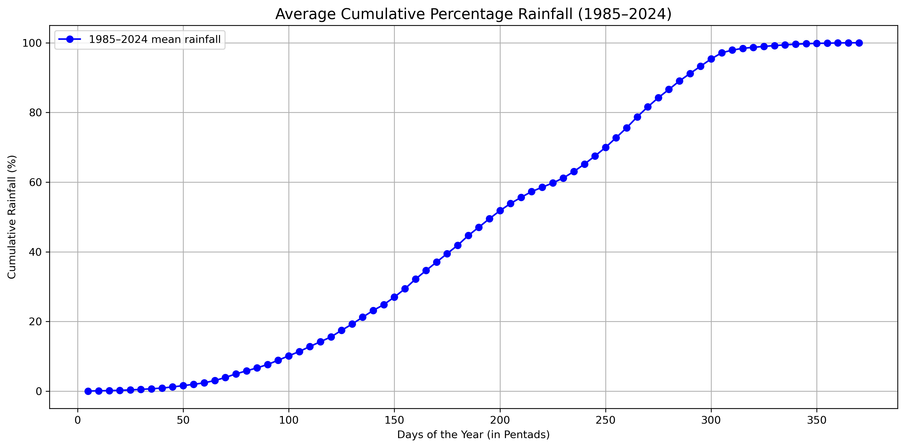
**Figure 1.** Sample of rainfall cumululative chart (year 2024) showing the sharp decline in rainfall during the Little Dry Season across southwestern Nigeria.

## Objectives
The project aims to evaluate recent changes in the characteristics of the Little Dry Season (LDS) across southwestern Nigeria and investigate the influence of Gulf of Guinea sea surface temperatures.

Specifically, the study seeks to:

- Detect the annual onset and cessation dates of the Little Dry Season using a cumulative percentage rainfall approach.
- Quantify key LDS characteristics, including duration, total rainfall, number of rain days, mean daily rainfall, rainfall per rain day, and rainfall intensity index.
- Examine long-term trends in these characteristics between 1985 and 2024.
- Analyse temporal variability in Gulf of Guinea Sea Surface Temperature (SST) and SST anomalies.
- Evaluate statistical relationships between LDS characteristics and SST anomalies using correlation and cross-correlation analyses.
- Provide insights into how regional ocean warming may influence sub-seasonal rainfall behaviour and climate adaptation in southwestern Nigeria.

## Study Area
The study covers mostly the **Southwestern Nigeria**, extending approximately between **4°–9°N** and **3°–7°E**, where the Little Dry Season is most pronounced. This specifically includes Lagos, Ogun, Oyo, Osun, Ondo, Ekiti, and adjoining areas of Edo which fall within the LDS climatic zone.
The region experiences a humid tropical climate characterized by a **bimodal rainfall regime**, with rainfall peaks occurring around **July** and **September**, separated by the Little Dry Season during July–August.
Rainfall in the region is strongly influenced by the West African Monsoon, the migration of the Intertropical Discontinuity (ITD), and ocean–atmosphere interactions over the Gulf of Guinea. These factors make southwestern Nigeria one of the most suitable regions for studying changes in intra-seasonal rainfall variability.

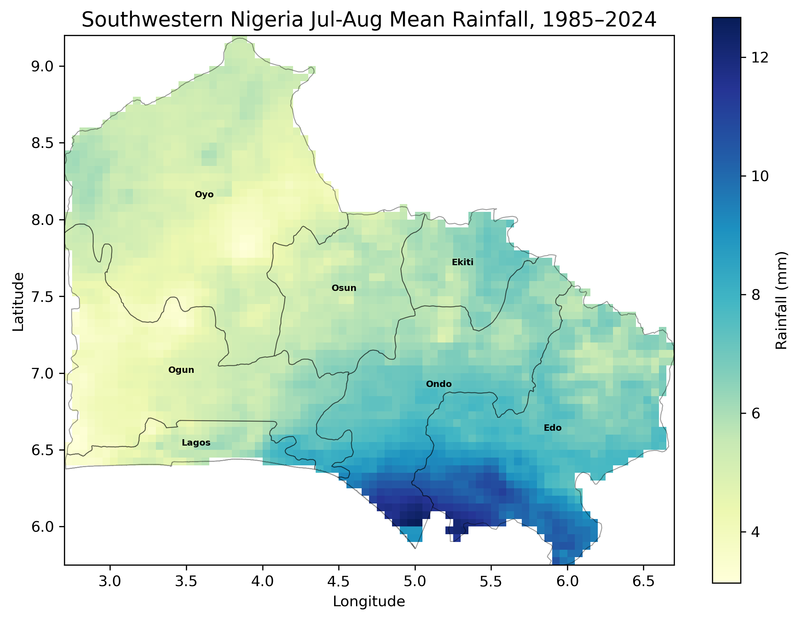
**Figure 2.** Study area showing southwestern Nigeria and average rainfall distribution during July - August Period

## Data & Methodology

### Datasets
| Dataset | Source | Resolution | Period | Purpose |
|----------|--------|------------|--------|---------|
| CHIRPS Daily Precipitation | Climate Hazards Center | 0.05° | 1985–2024 | Derivation of LDS characteristics |
| NOAA OISST v2.1 Monthly SST | NOAA | 0.25° | 1985–2024 | Detection of Gulf of Guinea SST Trends and Anomalies |

### Methodology
The analysis was implemented entirely in **Python** using libraries including **xarray**, **NumPy**, **Pandas**, **Matplotlib**, **Rioxarray**, **GeoPandas**, and **SciPy**.
The workflow consisted of the following steps:

1. **Rainfall preprocessing**
   - Loaded and cleaned CHIRPS daily rainfall data for analysis
   - Spatially averaged daily rainfall over southwestern Nigeria.
   - Generated cumulative rainfall percentage curves for each year.
   - Generated rainfall curves for each decade 

2. **LDS detection**
   - Applied the **5-day cumulative percentage rainfall (pentad)** method to identify annual LDS onset and cessation pentad dates and saved values in a summary table. 
   - Converted pentad dates into calendar dates and day-of-year values.
  
### 3. Derivation of LDS Characteristics / Metrics
The following annual LDS metrics were derived for each year to characterize the timing, duration, and rainfall conditions of the Little Dry Season:

- **Duration (days):** Number of days between the identified onset and cessation of the LDS, indicating its persistence.
- **Total rainfall (mm):** Total rainfall received during the LDS period, representing the overall rainfall amount.
- **Number of rain days (≥ 1 mm):** Count of days with at least 1 mm of rainfall during the LDS, indicating rainfall occurrence.
- **Rain-day frequency (%):** Percentage of LDS days that experienced rainfall (≥ 1 mm), indicating how often rainfall occurred during the season.
- **LDS Rainfall per rain day (mm rain day⁻¹):** Average rainfall on rainy days only (≥ 1 mm), excluding dry days.
- **LDS Mean Daily Rainfall Intensity Index (%):** Percentage departure of the mean daily rainfall during the LDS from the surrounding rainy-season mean, indicating the relative intensity of the Little Dry Season.

5. **Sea Surface Temperature analysis**
   - Extracted monthly SST over the Gulf of Guinea (0–5°N, 1–8°E).
   - Computed monthly climatology using the **1991–2020 WMO baseline**.
   - Calculated June–July (JJ), July–August (JA), and June–August (JJA) SST anomalies.
The generated LDS Metrics and SST Anomalies were added to the summary table. 

6. **Trend analysis**
   - Evaluated long-term trends in LDS characteristics and SST using line plots and linear regression.

7. **Relationship analysis**
   - Performed Pearson correlation between LDS characteristics and SST indices.
   - Conducted month-by-month cross-correlation to identify the periods when Gulf of Guinea SST exhibits the strongest relationship with subsequent LDS behaviour.

                                   PROJECT WORKFLOW

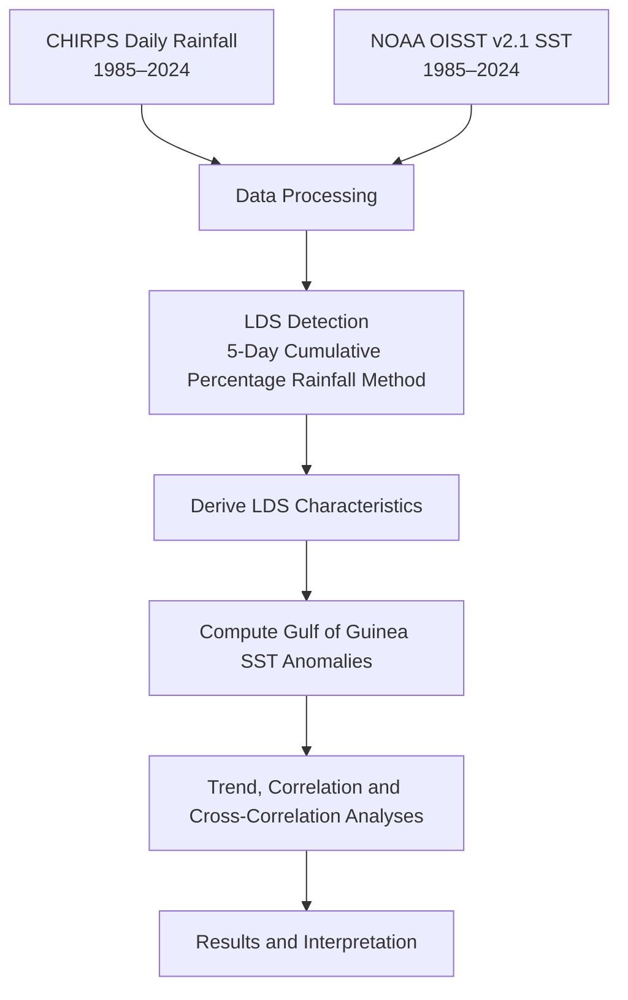
**Figure 3.** Workflow summarizing the datasets, preprocessing, LDS detection, metric derivation, SST anomaly computation, and statistical analyses.

## Results & Discussion

### 1. Identification and Evolution of the Little Dry Season
The Little Dry Season (LDS) was identified using the cumulative percentage rainfall method proposed by Odekunle (2004). Rather than relying on absolute rainfall totals, this approach expresses cumulative annual rainfall as a percentage of the yearly total. Periods where the cumulative rainfall curve becomes noticeably flatter indicate a temporary reduction in rainfall accumulation and correspond to the Little Dry Season.

A sample annual cumulative rainfall curve is first shown to illustrate how the onset and cessation of the LDS were visually identified. The onset corresponds to the point where the cumulative curve begins to flatten, while the cessation marks the point where the curve resumes a steeper upward trajectory.

**Figure 3.** Cumulative rainfall curve for year 2024 displayed as a sample. 

If interested in inspecting every individual year, kindly expand the section below.

<strong>View cumulative rainfall curves for all years (1985–2024)</strong>

To investigate long-term changes, cumulative rainfall curves were averaged by decade and compared with the overall climatological mean (1985–2024).
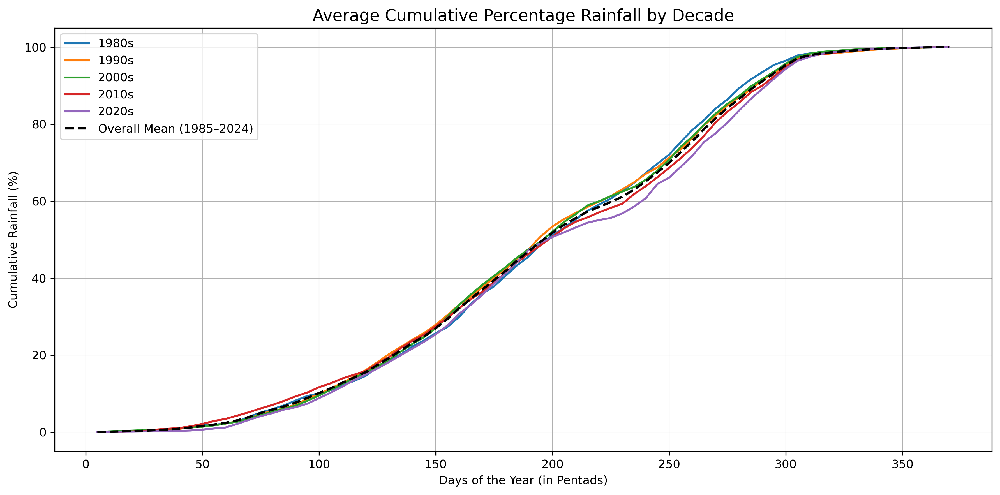
**Figure 4.** Average cumulative percentage rainfall by decade relative to the overall climatology (1985–2024).

The decade-average curves reveal a gradual evolution in the rainfall accumulation pattern over southwestern Nigeria. During the LDS period (approximately July–August), the curves representing the earlier decades (1980s and 1990s) generally remain above the long-term mean, whereas the 2010s and especially the 2020s lie below it for much of the same interval. This indicates that a smaller proportion of the annual rainfall is being accumulated during the Little Dry Season in recent decades.

While the cumulative rainfall curves provide qualitative evidence of evolving LDS behaviour, they do not by themselves distinguish whether the changes arise from reduced rainfall totals, fewer rain days, longer dry spells, or changes in rainfall intensity. These aspects are quantified in the derived LDS metrics presented in the following section.

## 2. Derived Annual LDS Characteristics
Using the identified onset and cessation dates, annual LDS characteristics were derived for each year from 1985 to 2024. These metrics quantify changes in the timing, duration, rainfall occurrence, and rainfall distribution within the Little Dry Season and form the basis of the subsequent trend and correlation analyses.

The table below presents a preview of the derived annual dataset. The complete dataset is available in [`outputs/tables/lds_metrics_table.csv`](outputs/tables/lds_metrics_table.csv)

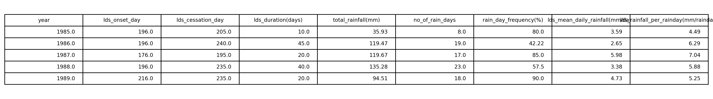
**Table 1.** Preview of the annual LDS characteristics derived for 1985–2024.

## 3. Long-term Changes in Little Dry Season Characteristics
The annual LDS characteristics derived from the cumulative rainfall analysis reveal that the Little Dry Season has changed over the last four decades, although the magnitude and direction of change differ among the individual metrics.

### 3.1 Changes in Timing

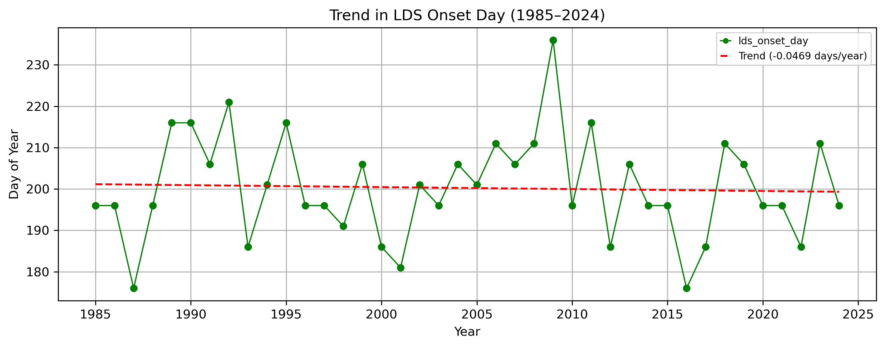
**Figure 5.** Annual variation and linear trend in LDS onset day (1985–2024).

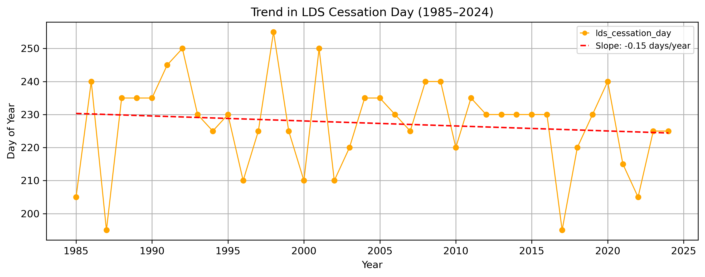
**Figure 6.** Annual variation and linear trend in LDS cessation day (1985–2024).

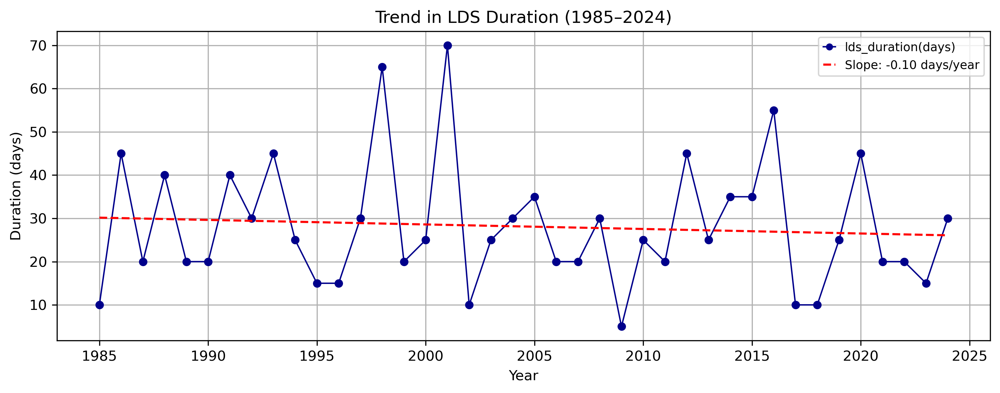
**Figure 7.** Annual variation and linear trend in LDS duration.

The timing characteristics of the Little Dry Season exhibit pronounced interannual variability but only modest long-term changes over the study period. The onset date fluctuates considerably from one year to another, spanning from late June to late August, yet displays only a very weak negative trend (**−0.05 days year⁻¹**). This indicates that, despite substantial year-to-year differences, there is little evidence of a systematic long-term shift in the timing of LDS onset.

In contrast, the cessation date exhibits a more consistent tendency towards earlier occurrence, with a negative trend of **−0.15 days year⁻¹**, equivalent to an advance of approximately **6 days** between 1985 and 2024. This tendency becomes visually more apparent in the later years of the record, where earlier cessation dates occur more frequently than during the first half of the study period. Consequently, the duration of the LDS also shows a gradual decline (**−0.10 days year⁻¹**), representing a shortening of approximately **4 days** over the study period.

Overall, while the trend lines suggest a gradual shift towards a slightly earlier cessation and a shorter Little Dry Season, the relatively shallow slopes compared with the pronounced interannual variability indicate that natural year-to-year climate variability remains the dominant influence on LDS timing.

---

### 3.2 Changes in Rainfall Characteristics

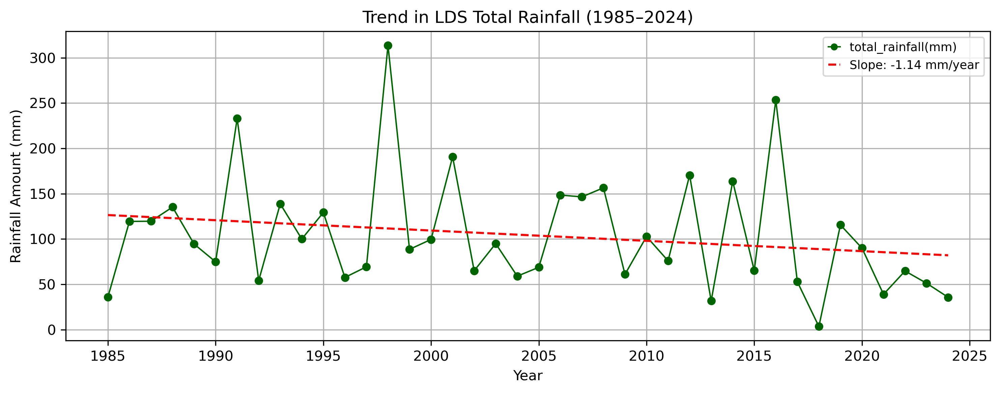
**Figure 8.** Annual variation and trend in total rainfall during the LDS.

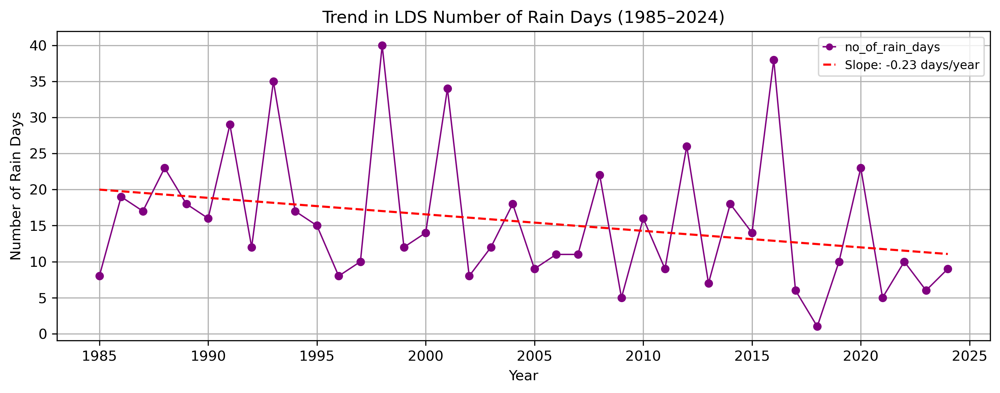
**Figure 9.** Annual variation and trend in the number of rain days.

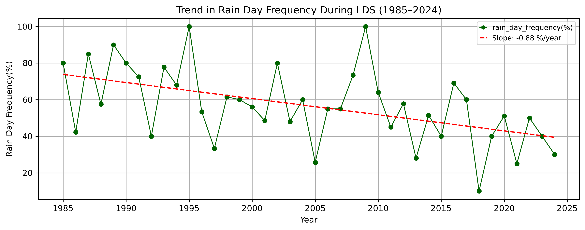
**Figure 10.** Annual variation and trend in rain-day frequency.

In contrast to the timing metrics, the rainfall characteristics exhibit more pronounced long-term changes, with all three indicators showing consistent declining trends over the study period. Total rainfall during the Little Dry Season decreases at a rate of **−1.14 mm year⁻¹**, representing a reduction of approximately **46 mm** between 1985 and 2024. The trend line declines from roughly **125 mm** in the earlier years to about **80 mm** in recent years, with the reduction becoming visually more apparent in the latter part of the record, particularly after **2017**.

The number of rain days also exhibits a steady decline (**−0.23 days year⁻¹**), corresponding to a reduction of approximately **9 rain days** over the study period. This reduction is reinforced by the rain-day frequency, which declines by **−0.88 percentage points year⁻¹**, decreasing from over **70%** of LDS days experiencing rainfall in the earlier years to approximately **40%** in recent years.

Because rain-day frequency normalizes rainfall occurrence by the duration of the LDS window, it demonstrates that the observed decline is not simply a consequence of the slight shortening of the season. Instead, rainfall is occurring on a progressively smaller proportion of LDS days, indicating that rainfall occurrence is declining more rapidly than the overall rainfall amount.

Together, these findings suggest that the recent drying of the Little Dry Season is driven primarily by a reduction in rainfall occurrence rather than an equivalent reduction in total rainfall. This naturally raises the question of whether the rainfall events themselves have also changed. The next section addresses this by examining how rainfall is distributed across the entire LDS period compared with rainfall received only on days when rain actually occurred.

---

### 3.3 Changes in Rainfall Distribution Within the Little Dry Season
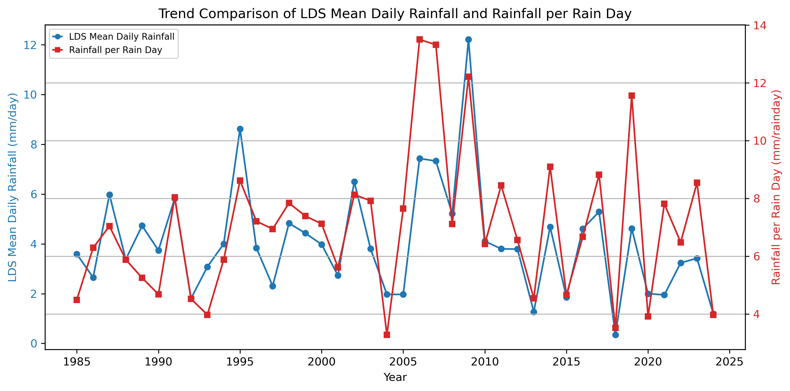
**Figure 11.** Diverging long-term trends in rainfall per LDS duration and rainfall per LDS rain day (1985–2024).

The previous section showed that rainfall during the Little Dry Season has become less frequent, with rain occurring on a progressively smaller proportion of days within the season. To examine how rainfall is distributed, rainfall per LDS duration (average rainfall across all LDS days) was compared with rainfall per LDS rain day (average rainfall on days when rain occurred).

The two metrics exhibit similar year-to-year behaviour during the first half of the record. However, from around **2010** onwards, their long-term trends begin to diverge. Rainfall per LDS duration shows a slight declining tendency, reflecting the overall reduction in rainfall received during the season, whereas rainfall per LDS rain day exhibits a gradual increase, indicating that rainfall events are becoming more intense on average.

This widening separation suggests that, although rainfall now occurs on fewer days, individual rainfall events tend to deliver more rainfall when they occur. Together with the declining trends in total rainfall, rain days, and rain-day frequency, these findings indicate that the Little Dry Season is evolving towards **less frequent but more intense rainfall events**, reflecting a shift in rainfall distribution rather than a uniform decline in rainfall.

Using the **3 mm day⁻¹** threshold proposed by Adejuwon and Odekunle as an indicator of rainfall adequacy for rain-fed agriculture in southwestern Nigeria, the rainfall per LDS duration metric further suggests an increase in LDS severity in recent years. While earlier years generally remained above this threshold, **three of the last five years** fell below **3 mm day⁻¹**, indicating that rainfall during the LDS has increasingly become insufficient to meet the daily water requirements of crops despite the occurrence of occasional intense rainfall events.

## 4. Long-term Changes in Gulf of Guinea Sea Surface Temperature
The previous sections established that the Little Dry Season has become characterized by fewer rainfall days and increasingly concentrated rainfall events. To investigate a potential driver of these changes, long-term variations in Gulf of Guinea sea surface temperature (SST) were examined.

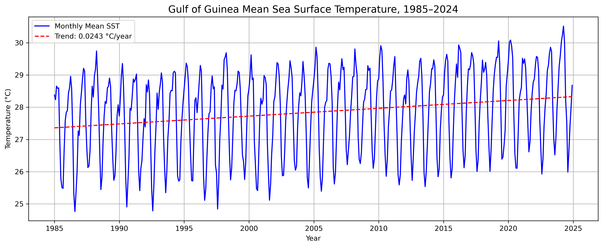
**Figure 12.** Annual mean Gulf of Guinea sea surface temperature (1985–2024).

The Gulf of Guinea exhibits a clear long-term warming trend over the study period despite substantial seasonal variability. Mean SST increases at approximately **0.024 °C year⁻¹**, equivalent to nearly **1 °C** of warming over the 40-year record. While the strong annual cycle dominates the monthly observations, the positive trend indicates a persistent warming of the regional ocean.

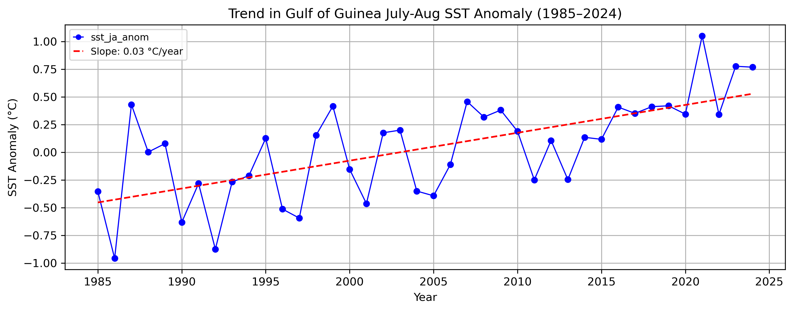
**Figure 13.** Trend in July–August Gulf of Guinea sea surface temperature anomaly (1985–2024).

The July–August SST anomaly also displays a positive long-term trend of approximately **0.03 °C year⁻¹**, with recent years consistently exhibiting positive anomalies relative to the long-term average. In particular, the warmest anomalies occur predominantly after the mid-2010s, suggesting that the Gulf of Guinea has experienced increasingly warmer conditions during the period when the Little Dry Season typically develops.

The concurrent warming of the Gulf of Guinea and changes in the Little Dry Season warrant further investigation of their relationship. The following sections examine the statistical links between SST variability and LDS characteristics

## 5. Relationship Between Little Dry Season Characteristics and Gulf of Guinea SST
To examine potential ocean–atmosphere influences on the Little Dry Season, seasonal SST indices (July–August mean SST, July–August SST anomaly, June–July SST anomaly, and June–August SST anomaly) were merged with the annual LDS metrics. Pearson correlation analysis was then used to quantify the strength and direction of the relationships between SST variability and each LDS characteristic.

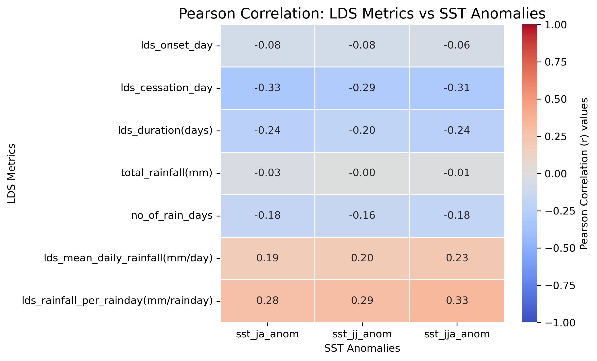
**Figure X.** Pearson correlation between Gulf of Guinea SST indices and Little Dry Season characteristics.

Overall, the relationships between Gulf of Guinea SST and the Little Dry Season were generally **weak to moderate**, suggesting that SST is an important contributing factor but not the sole control on LDS variability.

Among the timing metrics, **LDS cessation** exhibited the strongest association with SST, with consistent moderate negative correlations across all SST indices (*r* ≈ −0.29 to −0.33). **LDS duration** also showed weak-to-moderate negative correlations (*r* ≈ −0.20 to −0.24), whereas **LDS onset** was only weakly related to SST (*r* < |0.10|), indicating that the beginning of the LDS is comparatively insensitive to Gulf of Guinea temperature variability.

Rainfall characteristics displayed contrasting responses. **Total rainfall** showed virtually no correlation with SST (*r* ≈ 0), while **number of rain days** exhibited weak negative correlations (*r* ≈ −0.16 to −0.18). In contrast, **rainfall per LDS duration** showed weak positive correlations (*r* ≈ 0.19–0.23), and **rainfall per LDS rain day** consistently produced the strongest positive relationships (*r* ≈ 0.28–0.33) among all rainfall metrics.

These results suggest that warmer Gulf of Guinea conditions are associated less with changes in the total amount of rainfall received during the Little Dry Season and more with **how rainfall is distributed within the season**. Specifically, higher SSTs tend to coincide with fewer rainfall days but greater rainfall intensity on the days when rainfall occurs, reinforcing the rainfall distribution changes identified in the previous sections.

### 5.1 Seasonal Influence of SST on the Little Dry Season
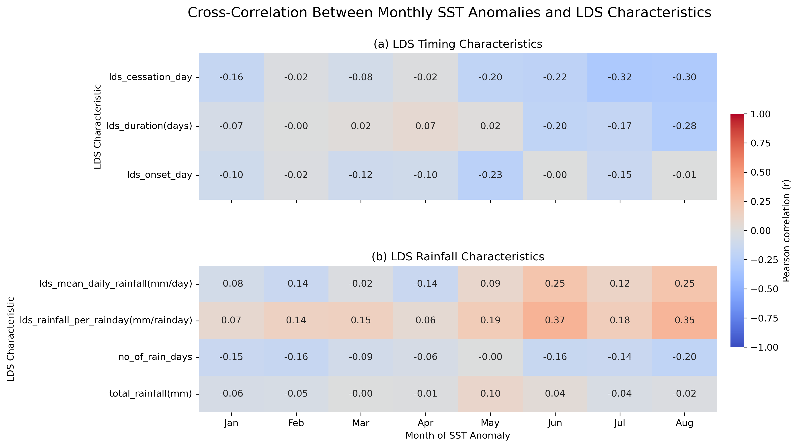

**Figure X.** Monthly cross-correlation between Gulf of Guinea SST anomalies and Little Dry Season characteristics.

To identify when Gulf of Guinea SST exerts the greatest influence on the Little Dry Season, monthly SST anomalies from **January to August** were correlated with each LDS characteristic. This analysis assesses whether SST conditions preceding the LDS, as well as those during the season itself, are associated with changes in its timing and rainfall characteristics.

Most correlations during the first half of the year (January–April) were weak, suggesting that SST anomalies several months before the onset of the LDS have limited influence on its subsequent behaviour. Stronger relationships emerged from **June onwards**, particularly for rainfall characteristics.

Among the rainfall metrics, **rainfall per LDS rain day** showed the strongest positive relationship, peaking with the **June SST anomaly** (*r* = 0.37) and remaining moderately positive in **August** (*r* = 0.35). **Rainfall per LDS duration** also exhibited its highest positive correlations during **June** and **August** (*r* ≈ 0.25), indicating that warmer Gulf of Guinea conditions around the onset of the LDS are associated with more intense rainfall events.

The timing characteristics displayed weaker responses overall. However, **LDS cessation** consistently exhibited moderate negative correlations from **June to August** (*r* ≈ −0.22 to −0.32), whereas **LDS onset** remained only weakly related to SST throughout the year. This suggests that SST variability influences how the Little Dry Season evolves and ends more than when it begins.

Overall, these results indicate that Gulf of Guinea SST anomalies have their greatest influence **during the months immediately preceding and overlapping the Little Dry Season**, particularly on rainfall intensity and cessation. Earlier-season SST anomalies contribute comparatively little, implying that the evolution of ocean conditions close to the LDS period is more relevant than anomalies established several months in advance.

# 6. Key Findings
- The cumulative percentage rainfall approach successfully identified the Little Dry Season (LDS) across all study years and revealed a gradual reduction in the proportion of annual rainfall occurring during the LDS, particularly from the 2010s onward.

- Long-term changes in LDS timing were relatively modest. While the onset exhibited substantial year-to-year variability with little overall shift, the cessation showed a slight tendency to occur earlier, resulting in a modest shortening of the LDS duration.

- Rainfall characteristics displayed more pronounced changes than timing characteristics. Total rainfall, number of rain days, and rain-day frequency all exhibited declining trends, indicating that rainfall is occurring on progressively fewer days during the LDS.

- A comparison of rainfall distribution metrics revealed an emerging divergence after approximately 2010. LDS mean daily rainfall declined slightly, whereas rainfall per LDS rain day increased, suggesting that rainfall events have become less frequent but more intense.

- Based on the 3 mm day⁻¹ threshold proposed by Adejuwon and Odekunle for rainfall adequacy during the growing season, three of the last five study years recorded rainfall per LDS duration below this threshold, indicating increasing agricultural relevance of recent LDS conditions.

- The Gulf of Guinea experienced a persistent warming trend of approximately **0.024 °C year⁻¹**, while July–August SST anomalies increased by approximately **0.03 °C year⁻¹**, confirming continued ocean warming throughout the study period.

- Pearson correlation analysis showed generally weak-to-moderate relationships between SST variability and LDS characteristics. The strongest associations occurred with LDS cessation and rainfall distribution metrics, whereas total rainfall and LDS onset exhibited little relationship with SST.

- Monthly cross-correlation analysis indicated that SST anomalies during **June to August** were more strongly associated with LDS characteristics than anomalies earlier in the year, suggesting that ocean conditions immediately preceding and during the LDS are more influential than those established months beforehand.

# 7. Conclusion
This study shows that recent changes in the Little Dry Season are characterized more by shifts in **rainfall distribution** than by substantial changes in seasonal timing. Rainfall is increasingly concentrated into fewer, more intense events, even though the overall duration and timing of the season have remained relatively stable.

The concurrent warming of the Gulf of Guinea and its weak-to-moderate relationships with several LDS characteristics suggest that regional ocean warming contributes to these evolving rainfall patterns, particularly through its influence on rainfall intensity and cessation. However, the generally modest correlation strengths indicate that SST alone cannot fully explain LDS variability, highlighting the likely roles of atmospheric circulation, moisture transport, and other climate drivers.

Overall, the findings demonstrate that evaluating rainfall distribution alongside traditional timing metrics provides a more complete understanding of how the Little Dry Season is evolving under a changing climate.

# Implications & Recommendations

The observed shift towards fewer but more intense rainfall events during the Little Dry Season has important implications for agriculture, water resources, and climate adaptation across southwestern Nigeria.

- **For farmers:** Avoid using isolated heavy rainfall events as indicators for rain-dependent activities, as the LDS is becoming increasingly characterized by fewer rain days and prolonged dry intervals.
- **For agricultural planning:** Incorporate seasonal climate forecasts and supplementary irrigation where possible to reduce risks associated with increasing rainfall variability.
- **For water resource management:** Improve rainwater harvesting and storage systems to capture intense rainfall events for use during extended dry periods.
- **For climate adaptation:** Integrate evolving LDS characteristics into agricultural advisories, drought monitoring, and regional climate adaptation strategies to enhance resilience.

# Limitations & Future Work

This study focused on regional-average rainfall characteristics and their relationship with Gulf of Guinea SST. Future work could strengthen these findings by:

- Incorporating **spatial analyses** to identify how LDS characteristics vary across different parts of southwestern Nigeria.
- Applying **machine learning approaches** to capture potentially non-linear relationships between SST and LDS characteristics.
- Including **atmospheric circulation variables**, particularly low-level wind components and moisture transport from the Gulf of Guinea, to better explain the physical mechanisms driving LDS variability.
