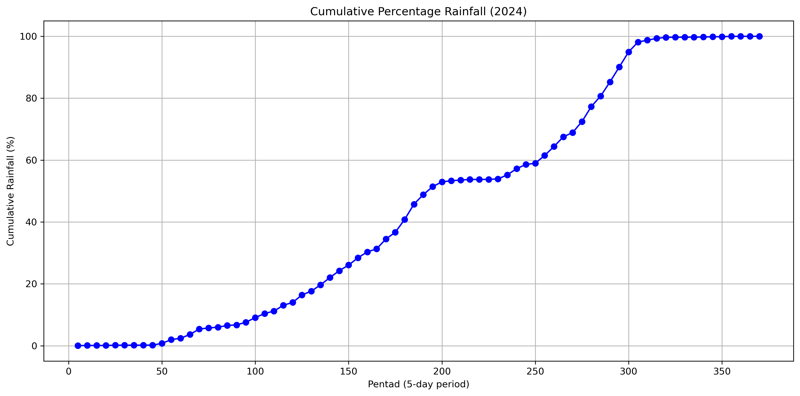

**Contents**
Title
Abstract
Background
Objectives
Study Area
Data & Methodology
Workflow chart
Results & Discussion (Splitted into Logical Sections)
Key Findings & Conclusion
Implication & Recommendation
Limitations & Future Work
Repository information
References
How to Reproduce. 

# Changes in the Characteristics of the Little Dry Season Across Southwestern Nigeria and Their Relationship with Gulf of Guinea Sea Surface Temperature

# Assessment of the Changing Characteristics of the Little Dry Season Across Southwestern Nigeria in Relation to Changes in Sea Surface Temperature over the Gulf of Guinea

## Background
The **Little Dry Season (LDS)** is a short-lived reduction in rainfall that occurs during the peak of the rainy season across southwestern Nigeria, typically between **mid-July and mid-August**. Despite its brief duration, it plays an important role in agriculture, water resource management, and ecosystem functioning. Farmers have traditionally relied on this seasonal break for activities such as weeding, fertilizer application, and harvesting, while the characteristics of the LDS have also been linked to the yield of important crops such as yam.

Over recent decades, however, the timing and behaviour of the LDS have become increasingly variable. Reports of delayed onset, prolonged duration, false seasonal breaks, and changing rainfall characteristics suggest that the phenomenon is responding to broader climatic changes. Such changes increase uncertainty for rain-fed agriculture, threaten food security, and complicate climate adaptation planning across the region.

The development of the LDS is influenced by a combination of atmospheric and oceanic processes, with **Sea Surface Temperature (SST)** variability over the **Gulf of Guinea** recognized as one of the dominant regional drivers. Changes in SST alter evaporation, atmospheric moisture availability, and convective activity, thereby influencing the distribution and intensity of rainfall across southwestern Nigeria.

Although previous studies have provided valuable insights into the variability of the LDS, many have relied on station observations or relatively short temporal records, limiting their ability to detect long-term regional changes. Furthermore, comparatively few studies have comprehensively examined how changes in Gulf of Guinea SST influence the evolving characteristics of the LDS over multiple decades. This project addresses these gaps by integrating **40 years (1985–2024)** of high-resolution CHIRPS rainfall observations with **NOAA Optimum Interpolation Sea Surface Temperature (OISST v2.1)** data to investigate how the characteristics of the Little Dry Season have evolved under a warming climate and to assess the role of Gulf of Guinea SST variability in shaping these changes.

**Figure 1.** Long-term monthly rainfall climatology showing the bimodal rainfall pattern and the Little Dry Season across southwestern Nigeria.

## Objectives
The project aims to evaluate recent changes in the characteristics of the Little Dry Season (LDS) across southwestern Nigeria and investigate the influence of Gulf of Guinea sea surface temperatures.

Specifically, the study seeks to:

- Detect the annual onset and cessation dates of the Little Dry Season using a cumulative percentage rainfall approach.
- Quantify key LDS characteristics, including duration, total rainfall, number of rain days, mean daily rainfall, rainfall per rain day, and rainfall intensity index.
- Examine long-term trends in these characteristics between 1985 and 2024.
- Analyse temporal variability in Gulf of Guinea Sea Surface Temperature (SST) and SST anomalies.
- Evaluate statistical relationships between LDS characteristics and SST anomalies using correlation and cross-correlation analyses.
- Provide insights into how regional ocean warming may influence sub-seasonal rainfall behaviour and climate adaptation in southwestern Nigeria.

## Study Area
The study covers **Southwestern Nigeria**, extending approximately between **4°–9°N** and **3°–7°E**, where the Little Dry Season is most pronounced. The analysis includes Lagos, Ogun, Oyo, Osun, Ondo, Ekiti, and adjoining areas of Edo that fall within the LDS climatic zone.
The region experiences a humid tropical climate characterized by a **bimodal rainfall regime**, with rainfall peaks occurring around **July** and **September**, separated by the Little Dry Season during July–August.
Rainfall in the region is strongly influenced by the West African Monsoon, the migration of the Intertropical Discontinuity (ITD), and ocean–atmosphere interactions over the Gulf of Guinea. These factors make southwestern Nigeria one of the most suitable regions for studying changes in intra-seasonal rainfall variability.
*Insert your study area map here.*

## Data & Methodology

### Datasets

| Dataset | Source | Resolution | Period | Purpose |
|----------|--------|------------|--------|---------|
| CHIRPS Daily Precipitation | Climate Hazards Center | 0.05° | 1985–2024 | Derivation of LDS characteristics |
| NOAA OISST v2.1 Monthly SST | NOAA | 0.25° | 1985–2024 | Detection of Gulf of Guinea SST Trends and Anomalies |

### Methodology
The analysis was implemented entirely in **Python** using libraries including **xarray**, **NumPy**, **Pandas**, **Matplotlib**, **Rioxarray**, **GeoPandas**, and **SciPy**.
The workflow consisted of the following steps:

1. **Rainfall preprocessing**
   - Spatially averaged CHIRPS daily rainfall over southwestern Nigeria.
   - Generated annual cumulative rainfall percentage curves.

2. **LDS detection**
   - Applied a **5-day cumulative percentage rainfall (pentad)** method to identify annual LDS onset and cessation.
   - Converted pentad dates into calendar dates and day-of-year values.

3. **Derivation of LDS characteristics**
   - Duration (days)
   - Total rainfall (mm)
   - Number of rain days (≥ 1 mm)
   - Mean daily rainfall during the LDS (mm day⁻¹)
   - Rainfall per rain day (mm rain day⁻¹)
   - Mean daily rainfall intensity index (%)

4. **Sea Surface Temperature analysis**
   - Extracted monthly SST over the Gulf of Guinea (0–5°N, 1–8°E).
   - Computed monthly climatology using the **1991–2020 WMO baseline**.
   - Calculated June–July (JJ), July–August (JA), and June–August (JJA) SST anomalies.

5. **Trend analysis**
   - Evaluated long-term trends in LDS characteristics and SST using linear regression.

6. **Relationship analysis**
   - Performed Pearson correlation between LDS characteristics and SST indices.
   - Conducted month-by-month cross-correlation to identify the periods when Gulf of Guinea SST exhibits the strongest relationship with subsequent LDS behaviour.

*Insert the workflow diagram immediately after this section.*
